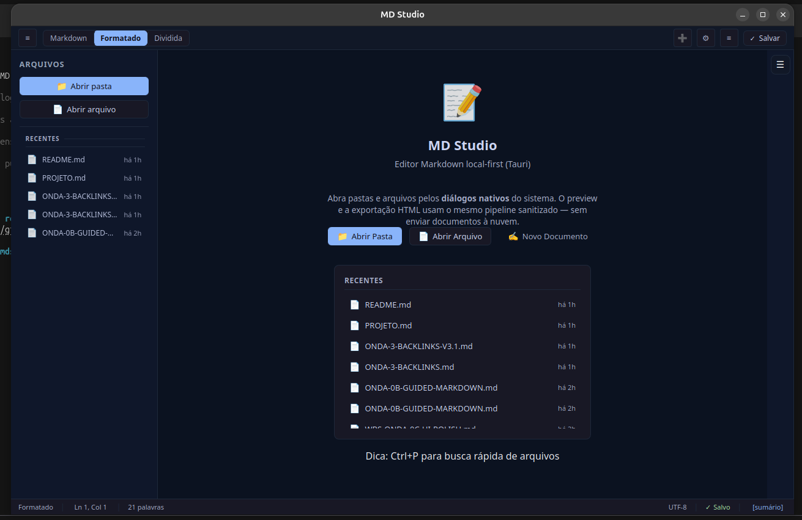
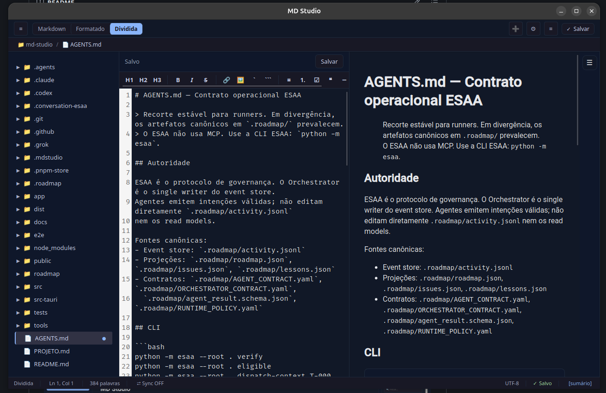
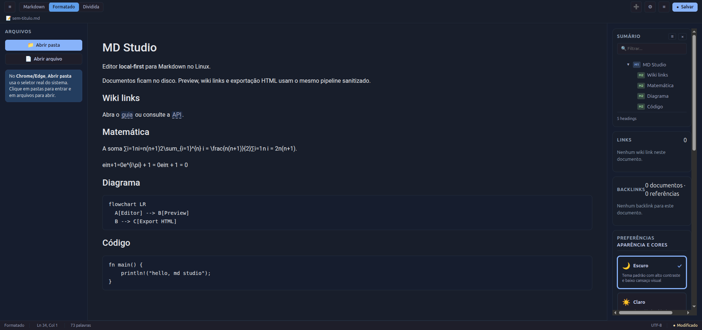

# MD Studio

Editor Markdown **local-first** para Linux, empacotado com **Tauri 2** (Rust + React/TypeScript).

Os documentos ficam no seu disco. Preview, wiki links, backlinks e exportação HTML usam o mesmo pipeline sanitizado — na tela e no arquivo exportado.



## Capturas

Editor e preview lado a lado, com sumário, wiki links e backlinks no painel direito:



Preview formatado (GFM, matemática, código e wiki links):



## Requisitos

- Node.js 20+
- pnpm 9+
- Rust 1.77+ (recomendado ≥ 1.88 para o crate Tauri neste lockfile)
- Dependências de build Tauri no host (webkit2gtk, etc.) — ver [docs/release/PACKAGING.md](docs/release/PACKAGING.md)

## Desenvolvimento

```bash
pnpm install
pnpm dev          # UI Vite (browser / fallback FS Access)
pnpm tauri dev    # shell nativo + diálogos do sistema
pnpm test         # Vitest
cargo test --manifest-path src-tauri/crates/md-studio-core/Cargo.toml
```

## Funcionalidades (v0.1)

- Workspace local (pasta ou arquivo) com path fence no Rust
- Editor CodeMirror 6 + preview (GFM, math, highlight, Mermaid)
- Wiki links `[[alvo]]` / `[[alvo|rótulo]]` com resolução, autocomplete e criação de nota
- Backlinks no painel direito (índice reverso só de links resolvidos)
- Salvamento atômico com detecção de conflito por hash
- **Watcher FS (notify)** com debounce; se o arquivo aberto estiver *dirty* e mudar no disco → diálogo Recarregar / Manter / Salvar como (sem sobrescrita silenciosa)
- **Export HTML** pelo mesmo pipeline sanitizado do preview + escrita atômica; confirma sobrescrita
- Diálogos nativos Tauri (abrir/salvar/confirmar)

## Empacotamento Linux

Alvos configurados em `src-tauri/tauri.conf.json`: **`.deb`** e **AppImage**.

```bash
pnpm tauri build
# artefatos em src-tauri/target/release/bundle/{deb,appimage}/
```

Detalhes: [docs/release/PACKAGING.md](docs/release/PACKAGING.md).

## Segurança

- Sem backend remoto; sem plugins JS arbitrários
- Paths canônicos no Rust; export só para caminho absoluto escolhido no diálogo
- HTML sanitizado (`rehype-sanitize`) antes do DOM e do export

## Licença

MIT — Livre para uso, adaptação e redistribuição.
