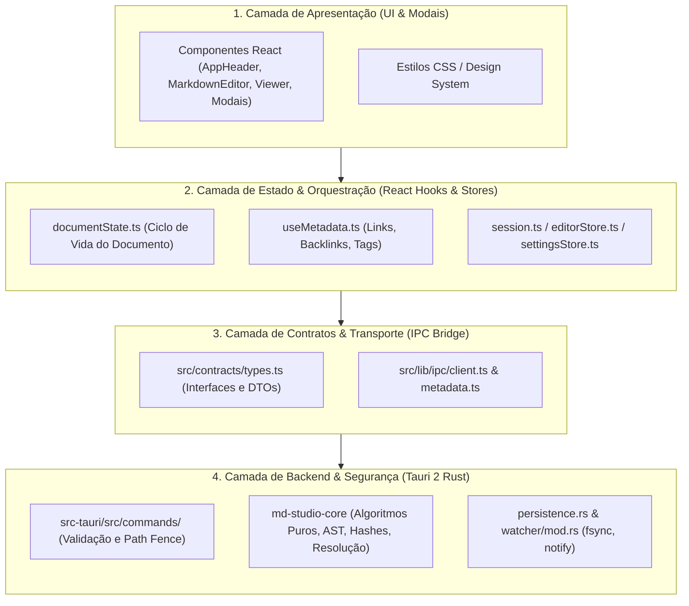

# Mapa de Funcionalidades, Funções e Rotas — MD Studio

**Versão do Produto:** v0.2.0 (Ondas 0-3 + Shiki & Hub Híbrido de Formatação Concluídos)  
**Stack:** Tauri 2 (Rust) + React 19 + TypeScript + CodeMirror 6 + Unified  
**Repositório:** [github.com/elzobrito/md-studio](https://github.com/elzobrito/md-studio)  
**Ambiente:** Desktop Linux (Local-first / Offline)

---

## 1. Mapeamento de Funcionalidades (Feature Matrix)

### 1.1. Autoria e Edição de Conteúdo
- **Editor CodeMirror 6 de Alta Fidelidade:** Editor monoespaçado otimizado para Markdown com numeração de linhas, realce de sintaxe em tempo real e quebra suave de linha (*soft wrap*).
- **Barra de Formatação Contextual (`FormattingToolbar`):** Ações rápidas para Títulos (`H1`, `H2`, `H3`), Negrito, Itálico, Tachado, Links, Imagens, Código inline, Blocos de código, Citações, Listas (ul, ol, tarefas), Tabelas e Divisores.
- **Barra de Ferramentas de Tabela (`TableToolbar`):** Aparece automaticamente quando o cursor está dentro de uma tabela Markdown, permitindo inserir/remover linhas e colunas e formatar alinhamentos.
- **Menu de Comandos Rápidos / Slash Commands (`/`):** Digitar `/` no início de linha vazia abre um menu suspenso para inserção instantânea de blocos (código, tabelas, alertas, fórmulas, diagramas).
- **Colagem Inteligente (*Smart Paste*):** Detecta links colados sobre texto selecionado e transforma automaticamente em `[texto](url)` sem perder o texto original; converte tabelas HTML/Excel em tabelas Markdown.
- **Dicas Contextuais de Markdown (*Contextual Hints*):** Pequenas dicas informativas de atalho e sintaxe exibidas discretamente no rodapé do editor conforme o contexto do cursor.

### 1.2. Modelos de Documento (*Templates*)
- **Modal de Modelos (`NewDocumentModal`):** Disparado em todos os pontos de criação (`+` no cabeçalho, `Novo documento` na tela inicial, área vazia ou `Ctrl+N`).
- **7 Modelos Integrados:**
  1. **📄 Em branco:** Inicia com o editor limpo.
  2. **🤝 Reunião:** Pauta, participantes, decisões e tabela de ações com data dinâmica em pt-BR.
  3. **📊 Relatório:** Sumário executivo, contexto, desenvolvimento e conclusões com data dinâmica.
  4. **📓 Anotações:** Conceitos principais, exemplos, dúvidas e resumo pessoal.
  5. **📐 Especificação:** Versão, status, escopo (dentro/fora), requisitos funcionais/não-funcionais.
  6. **📔 Diário:** Reflexão, aprendizados, metas e gratidão com data formatada.
  7. **📦 README:** Template completo de documentação de projetos open-source.

### 1.3. Pipeline de Renderização & Visualização (AST)
- **Pipeline Sanitizado e Seguro:** Processamento via Unified/Remark/Rehype com isolamento estrito contra XSS (`rehype-sanitize`).
- **CommonMark & GFM:** Suporte integral a tabelas, task lists (`- [x]`), autolinks, emojis e notas de rodapé.
- **KaTeX:** Renderização de fórmulas matemáticas inline (`$...$`) e em bloco (`$$...$$`).
- **Mermaid:** Renderização reativa de diagramas de sequência, fluxogramas, grafos e diagramas de classe em container SVG isolado com tratamento seguro de erros de sintaxe.
- **Shiki Syntax Highlighting (TextMate Dual Themes):** Realce de sintaxe de alta precisão via Shiki (`@shikijs/rehype`) com suporte nativo a temas duplos simultâneos (`github-light` e `github-dark`) mapeados para variáveis CSS (`.theme-light`, `.theme-dark`, auto). Singleton Wasm com overhead zero de inicialização.
- **Alertas / Callouts GFM:** Suporte a `> [!NOTE]`, `> [!TIP]`, `> [!IMPORTANT]`, `> [!WARNING]` e `> [!CAUTION]`.

### 1.4. Wiki Links e Conexões Bidirecionais
- **Sintaxe de Wiki Links:** Suporte a links internos no formato `[[alvo]]` e com rótulo customizado `[[alvo|Rótulo Visível]]`.
- **Autocompleção com Trigger `[[`:** Digitar `[[` no editor abre um menu flutuante listando todos os arquivos `.md` do workspace indexados.
- **Resolução de Links no Core Rust (`wiki_resolve.rs`):**
  - `Resolved`: Encontra correspondência unívoca no workspace.
  - `Ambiguous`: Mais de um arquivo possui o mesmo nome base em pastas diferentes.
  - `Unresolved`: Nota referenciada ainda não existe.
- **Painel de Links de Saída (`OutgoingLinksPanel`):** Exibe no painel direito todos os links contidos no documento atual com seus respectivos status.
- **Criação Rápida de Notas:** Clicar em um wiki link `Unresolved` abre o modal `CreateNoteFromWiki` para criar a nota no caminho correto e abri-la no editor.
- **Painel de Backlinks (`BacklinksPanel` - Onda 3):** Lista reversa de todos os outros documentos do workspace que apontam para o arquivo aberto, agrupados com snippet de contexto textual e navegação por clique direto para a linha da ocorrência.

### 1.5. Gestão de Workspace, Persistência Segura e Auto-Save
- **Local-First & Path Fencing:** Operações confinadas ao diretório raiz escolhido pelo usuário; rejeição no Rust de qualquer tentativa de *path traversal* (`../`).
- **Gravação Atômica (`save_document`):** Escrita em arquivo temporário com `fsync` seguido de renomeação atômica para evitar perda de dados por queda de energia.
- **Auto-Save com Debounce e Supressão Interna:** Salvamento automático configurável (1000ms a 5000ms, padrão 1500ms). Disparado pelo hook `useDocumentState` e integrado com o `WatcherHub` no Rust para registrar hashes de escritas internas com TTL, evitando falsos positivos no diálogo de conflito durante a digitação.
- **Detecção de Conflitos Concorrentes:** Verificação de SHA-256 antes da gravação. Se o arquivo no disco foi alterado externamente por outro processo, o diálogo `ConflictDialog` oferece opções: *Recarregar do Disco*, *Manter Edição Local* ou *Salvar Como*.
- **Observador de Arquivos (*Watcher FS*):** Motor `notify` em Rust observando modificações em tempo real com debounce estável e supressão inteligente de eventos internos.
- **Rascunhos de Recuperação Instantânea:** Armazenamento local imediato (`localStorage`) para restauração de edições não salvas após encerramento forçado do processo.
- **Exportação HTML Autossuficiente:** Botão `[⇩ Exportar HTML]` no cabeçalho; gera documento HTML autônomo com estilos embutidos e scripts seguros. Protegido para só ficar habilitado com arquivo ativo.

### 1.6. Hub Híbrido de Formatação de Código (Frontend Web + Backend Rust)
- **Camada Web (Prettier Standalone):** Formatação local instantânea no navegador sem dependências nativas para JavaScript, TypeScript, JSX, TSX, HTML, CSS, SCSS, Less, JSON, YAML e Markdown.
- **Camada Nativa (Rust IPC `format_code`):** Execução segura de formatadores CLI do sistema operacional (`ruff format -` para Python, `rustfmt` para Rust, `gofmt` para Go, `clang-format` para C/C++/C#/Java/Proto, `google-java-format`, `php-cs-fixer`, `dart format`).
- **Resiliência e Fallback Seguro:** Execução em threads separadas para I/O com timeout de 2 segundos; se a ferramenta CLI estiver ausente ou o código contiver erros de sintaxe, o código original é preservado sem travar ou corromper o documento.
- **Ações de Interface (UX):**
  - Botão **Formatar** no cabeçalho de cada bloco de código no Preview com feedback visual animado (`Formatando...`, `✓ Formatado!`).
  - Comando e atalho **`Shift + Alt + F`** no editor CodeMirror 6 para formatar o bloco cercado sob o cursor.
  - Botão dedicado de formatação de código na `FormattingToolbar`.
  - Sincronização atômica in-place no documento Markdown ativo.

---

## 2. Rotas e Modos de Navegação da Interface (UI Routes)

O MD Studio adota uma arquitetura de rotas orientada a estados de visão e layout (`session.viewMode` e `documentState`), eliminando recargas de página.

### 2.1. Modos Principais de Visualização (*View Modes*)
| Modo | ID | Descrição |
|---|:---:|---|
| **Markdown** | `source` | Tela dedicada à edição de código-fonte no CodeMirror 6 com todas as barras de formatação. |
| **Formatado** | `preview` | Visualização renderizada somente leitura com o pipeline completo (GFM, KaTeX, Mermaid, Wiki Links). |
| **Dividida** | `split` | Edição e preview lado a lado com sincronização bidirecional de rolagem (*Scroll Sync*). |
| **Zen** | `zen` | Modo tela cheia imersivo ativado por `F11`, ocultando barras de ferramentas e painéis. |

### 2.2. Telas de Estado da Aplicação
| Tela | Condição | Descrição |
|---|---|---|
| **`WelcomeScreen`** | `!isWriting && !doc.relativePath && !doc.workspace` | Tela inicial de primeiro acesso com atalhos para *Novo documento*, *Abrir pasta*, *Abrir arquivo* e lista de *Arquivos recentes*. |
| **`EmptyState`** | `!isWriting && !doc.relativePath && doc.workspace` | Exibida quando uma pasta de trabalho foi aberta, mas nenhum arquivo está selecionado. |
| **`Editor Workspace`** | `Boolean(isWriting || doc.relativePath)` | Área de trabalho ativa com editor e/ou preview conforme o modo de visão selecionado. |

### 2.3. Modais e Diálogos de Interação
| Componente | Gatilho | Responsabilidade |
|---|---|---|
| **`NewDocumentModal`** | `Ctrl+N` / Botão `+` / Telas vazias | Escolha de templates (7 opções) ou documento em branco. |
| **`CommandPalette`** | `Ctrl+P` / `Ctrl+Shift+P` | Quick switcher para localizar e abrir notas do workspace por busca difusa (*fuzzy search*). |
| **`ShortcutsModal`** | `F1` / Botão `⌨` | Tabela visual com todos os atalhos de teclado do sistema. |
| **`GoToLine`** | `Ctrl+G` | Pula diretamente para uma linha específica do documento no CodeMirror. |
| **`SettingsPanel`** | `Ctrl+,` / Botão `⚙` | Painel de configurações visuais (Tema Escuro, Claro, Automático, Zoom). |
| **`CreateNoteFromWiki`** | Clique em link não resolvido | Diálogo de confirmação para criar nova nota `.md` a partir do link. |
| **`ConflictDialog`** | Modificação externa de arquivo aberto | Diálogo de resolução de conflitos (*Recarregar*, *Manter*, *Salvar Como*). |

### 2.4. Rotas de Navegação por Teclado (Global Keybindings)
O MD Studio dispõe de um barramento de atalhos globais gerenciado por [`useKeyboardShortcuts`](file:///home/elzobrito/desenvolvimento/md-studio/src/hooks/useKeyboardShortcuts.ts), que intercepta e despacha navegação sem colisões com campos de texto:

| Categoria | Atalho | Ação / Rota de Navegação Disparada |
|---|:---:|---|
| **Arquivo** | `Ctrl + N` | Abre o `NewDocumentModal` para seleção de template ou documento limpo. |
| **Arquivo** | `Ctrl + O` | Dispara o seletor nativo de arquivos (`pickMarkdownFile`) para abrir nota individual. |
| **Arquivo** | `Ctrl + Shift + O` | Dispara o seletor nativo de diretórios (`pickFolder`) para abrir pasta como workspace. |
| **Arquivo** | `Ctrl + S` | Persistência atômica do arquivo ativo (`save_document`). |
| **Arquivo** | `Ctrl + Shift + S` | Dispara fluxo "Salvar Como..." com seletor nativo. |
| **Arquivo** | `Ctrl + W` | Fecha o documento ativo e retorna à tela inicial ou vazia (`closeFile`). |
| **Visualização** | `Ctrl + 1` | Rota para o modo **Markdown** (`source`). |
| **Visualização** | `Ctrl + 2` | Rota para o modo **Formatado** (`preview`). |
| **Visualização** | `Ctrl + 3` | Rota para o modo **Dividida** (`split`). |
| **Visualização** | `F11` | Alterna para o modo **Zen** (imersão em tela cheia sem barras). |
| **Visualização** | `Ctrl + B` ou `Ctrl + \` | Alterna exibição da Barra Lateral Esquerda (Explorador de Arquivos). |
| **Visualização** | `Ctrl + J` ou `Ctrl + Shift + \` | Alterna exibição do Painel Direito (Sumário / Links / Backlinks). |
| **Visualização** | `Alt + S` | Alterna a sincronização de rolagem (*Scroll Sync*) no modo split. |
| **Navegação** | `Ctrl + P` / `Ctrl + Shift + P` | Abre o `CommandPalette` (busca difusa de notas). |
| **Navegação** | `Ctrl + G` | Abre o modal `GoToLine` para salto direto de linha. |
| **Navegação** | `Alt + ↑` | Navega ciclicamente para o arquivo recente anterior no histórico. |
| **Navegação** | `Alt + ↓` | Navega ciclicamente para o próximo arquivo recente no histórico. |
| **Editor** | `Ctrl + Home` | Salta o cursor diretamente para a primeira linha do documento. |
| **Editor** | `Ctrl + End` | Salta o cursor diretamente para a última linha do documento. |
| **Interface** | `F1` ou `Ctrl + /` | Abre/fecha o modal visual de ajuda e atalhos (`ShortcutsModal`). |
| **Interface** | `Ctrl + ,` | Abre o modal de configurações de tema e interface (`SettingsPanel`). |
| **Interface** | `Ctrl + =` / `Ctrl + +` | Amplia o nível de zoom da interface visual (*Zoom In*). |
| **Interface** | `Ctrl + -` | Reduz o nível de zoom da interface visual (*Zoom Out*). |
| **Interface** | `Ctrl + 0` | Restaura o zoom padrão de 100% da interface visual (*Zoom Reset*). |

### 2.5. Rotas de Navegação Interna de Conteúdo
1. **Navegação por Wiki Links (`[[alvo]]`):**
   - No preview (`MarkdownViewer`), links com classe `.wiki-link` interceptam o clique.
   - Links resolvidos (`Resolved`): invocam `onOpenRelative(path)` abrindo imediatamente o documento correspondente.
   - Links não-resolvidos (`Unresolved`): abrem o modal `CreateNoteFromWiki`, permitindo gerar o arquivo no disco com um clique.
2. **Navegação por Sumário / Headings:**
   - Clicar em qualquer cabeçalho no `DocumentOutline` aciona `scrollToHeading(slug, viewMode)`, calculando a posição e rolando suavemente a linha do CodeMirror ou a âncora do DOM renderizado.
3. **Navegação Reversa por Backlinks:**
   - Clicar em qualquer ocorrência no `BacklinksPanel` executa `openRelative(sourcePath)` e enfileira `queueGoToLine(occurrence.line)`, posicionando o cursor exatamente na linha do link referenciador.

---

## 3. Contratos, Rotas IPC e Eventos do Backend (Tauri 2 Rust)

Todas as rotas IPC e canais de eventos estão registrados em [`src-tauri/src/lib.rs`](file:///home/elzobrito/desenvolvimento/md-studio/src-tauri/src/lib.rs) e expostos com tipagem TypeScript segura em [`src/lib/ipc/`](file:///home/elzobrito/desenvolvimento/md-studio/src/lib/ipc).

### 3.1. Comandos IPC de Requisição e Resposta (Tauri Invokes — 20 Comandos)

| Comando IPC (Rota) | Módulo Rust | Parâmetros de Entrada | Retorno (Payload) | Descrição e Regras de Segurança |
|---|---|---|---|---|
| `open_workspace` | `commands::mod` | `path: String` | `WorkspaceDescriptor` | Registra e valida pasta raiz do workspace. Aplica canonicalização estrita de caminho. |
| `list_entries` | `commands::mod` | `workspace_id: String, subpath?: String` | `Vec<FileEntry>` | Lista recursiva de diretórios e arquivos `.md` respeitando a barreira do workspace (*path fence*). |
| `read_document` | `commands::mod` | `workspace_id: String, relative_path: String` | `DocumentSnapshot` | Lê arquivo `.md` e calcula hash SHA-256 do conteúdo para controle de concorrência. |
| `save_document` | `commands::mod` | `payload: SavePayload` | `SaveResult` | Gravação atômica com validação de hash esperado (`expectedHash`). Dispara atualização incremental do índice. |
| `search_workspace` | `commands::mod` | `workspace_id: String, query: String` | `Vec<SearchResult>` | Busca textual e por títulos em todos os arquivos do workspace. |
| `export_html` | `commands::mod` | `path: String, html: String, overwrite: bool` | `ExportResult` | Grava arquivo `.html` autossuficiente no caminho absoluto fornecido. Rejeita sobrescrita sem confirmação explícita. |
| `get_launch_path` | `commands::mod` | — | `Option<String>` | Obtém caminho de arquivo `.md` passado via linha de comando ou clique duplo do sistema operacional. |
| `close_splash` | `commands::mod` | — | `()` | Fecha a janela temporária de splash e exibe a janela principal de 1280x800 com foco. |
| `format_code` | `commands::formatter` | `language: String, code: String` | `FormatResult` | Formata bloco de código via ferramentas CLI locais (`ruff`, `rustfmt`, `gofmt`, `clang-format`) com timeout de 2s e fallback seguro. |
| `start_watching` | `watcher::mod` | `workspace_id: String, root_path: String` | `()` | Inicia o observador de filesystem (`notify`) na raiz com debounce para detectar alterações externas. |
| `stop_watching` | `watcher::mod` | — | `()` | Encerra com segurança o worker thread do observador de arquivos. |
| `get_workspace_stats` | `commands::metadata` | `workspace_id: String` | `WorkspaceStats` | Quantidade de documentos indexados, total de tags e links mapeados. |
| `get_document_metadata` | `commands::metadata` | `workspace_id: String, relative_path: String` | `Option<DocumentMetadata>` | Retorna frontmatter, tags e links extraídos de uma nota específica. |
| `get_all_documents` | `commands::metadata` | `workspace_id: String` | `Vec<DocumentSummary>` | Lista leve de todos os documentos para autocompleção rápida. |
| `trigger_reindex` | `commands::metadata` | `workspace_id: String` | `WorkspaceStats` | Varre novamente todo o workspace e regrava `.mdstudio/index.json`. |
| `get_wiki_links_for` | `commands::metadata` | `workspace_id: String, relative_path: String` | `Vec<ExtractedWikiLink>` | Extrai todos os wiki links crus contidos em uma nota. |
| `resolve_wiki_link` | `commands::metadata` | `workspace_id: String, from_path: String, target: String` | `ResolvedWikiLink` | Resolve caminho relativo unívoco no workspace (`Resolved`, `Ambiguous`, `Unresolved`). |
| `get_resolved_wiki_links_for` | `commands::metadata` | `workspace_id: String, relative_path: String` | `Vec<ResolvedWikiLink>` | Retorna os links do documento com seus status e caminhos canônicos calculados. |
| `get_tags` | `commands::metadata` | `workspace_id: String` | `Vec<TagInfo>` | Lista agregada de todas as tags `#tag` encontradas nos documentos. |
| `get_backlinks` | `commands::metadata` | `workspace_id: String, target_path: String` | `Vec<BacklinkOccurrence>` | **Onda 3:** Retorna todas as ocorrências de notas que apontam para o arquivo aberto, com linha (1-based) e snippet de contexto sob demanda. Self-links são excluídos. |

### 3.2. Rotas de Canais de Eventos Assíncronos (Tauri Event Channels)

Diferente dos comandos síncronos de requisição/resposta, os canais de eventos transmitem notificações reativas do Rust para o Frontend via barramento de eventos do Tauri (`tauri::Emitter`):

| Canal de Evento | Origem (Rust) | Payload | Listener Frontend | Comportamento e Regras de Negócio |
|---|---|---|---|---|
| **`workspace://change`** | `WatcherHub` (`watcher::mod`) | `WatchEventDto { type, relativePath, from?, workspaceId }` | `subscribeWorkspaceWatch` ([`client.ts`](file:///home/elzobrito/desenvolvimento/md-studio/src/lib/ipc/client.ts)) | Disparado em alterações no disco (criar, modificar, renomear, excluir) com debounce de 300ms. Se o arquivo alterado estiver aberto no editor com modificações não salvas (`dirty`), ativa a rota do modal `ConflictDialog`. |
| **`app://open-file`** | `tauri_plugin_single_instance` ([`lib.rs`](file:///home/elzobrito/desenvolvimento/md-studio/src-tauri/src/lib.rs)) | `{ path: String }` | `subscribeOpenFile` ([`client.ts`](file:///home/elzobrito/desenvolvimento/md-studio/src/lib/ipc/client.ts)) | Emitido quando o usuário abre outro arquivo `.md` no sistema operacional (via clique duplo ou CLI) com a aplicação já em execução. Carrega o arquivo na janela ativa e traz o app para o primeiro plano (*focus/unminimize*). |

### 3.3. Rotas de Integração com Plugins Nativos do Sistema Operacional

O MD Studio integra três plugins oficiais do ecossistema Tauri 2 para comunicação segura com o sistema de janelas e o desktop Linux:

| Plugin Tauri | Função / Método | Interface Frontend | Responsabilidade no Sistema |
|---|---|---|---|
| **`tauri-plugin-dialog`** | `open({ directory: true })` | `pickFolder()` | Abre caixa de diálogo nativa do desktop para seleção de pasta raiz do workspace. |
| **`tauri-plugin-dialog`** | `open({ directory: false, filters })` | `pickMarkdownFile()` | Abre diálogo nativo do sistema filtrado para extensões `.md` e `.markdown`. |
| **`tauri-plugin-dialog`** | `save({ filters })` | `pickSaveMarkdownFile()` / `pickSaveHtmlFile()` | Diálogo nativo para escolha de destino ao salvar novos arquivos Markdown ou exportar HTML. |
| **`tauri-plugin-dialog`** | `ask(message, { kind: "warning" })` | `confirmOverwrite(path)` | Alerta nativo modal do SO solicitando confirmação do usuário antes de sobrescrever arquivo existente. |
| **`tauri-plugin-single-instance`** | Callback de inicialização única | Interceptador no Rust | Garante uma única instância do processo do app: se executado novamente, redireciona o arquivo para a janela aberta via `app://open-file`, fecha o splash secundário e foca a janela principal. |
| **`tauri-plugin-opener`** | `openUrl` / Invocação segura | Handler de links externos | Abre links externos (`http://`, `https://`) com segurança no navegador padrão do usuário do Linux, sem executar código inseguro dentro do Webview. |

---

## 4. Estrutura de Funções e Hooks do Frontend (React / TypeScript)

### 4.1. Custom Hooks
- **`useDocumentState` ([`src/state/documentState.ts`](file:///home/elzobrito/desenvolvimento/md-studio/src/state/documentState.ts)):**
  - `openWorkspacePath(path)`: Abre workspace local.
  - `openRelative(path)`: Abre nota relativa com carregamento de rascunhos (*drafts*).
  - `openFile(absolutePath)`: Abertura direta via explorador nativo.
  - `save()` / `saveAs()`: Dispara rotinas de persistência segura com tratamento de erros.
  - `newDocument(initialText?)`: Limpa tela e aplica modelo de documento.
  - `closeFile()`: Fecha o arquivo ativo e retorna ao estado desocupado.
  - `resolveConflict(choice)`: Aplica estratégia de conflito (*reload*, *keep*, *saveAs*).

- **`useMetadata` ([`src/hooks/useMetadata.ts`](file:///home/elzobrito/desenvolvimento/md-studio/src/hooks/useMetadata.ts)):**
  - Carrega metadados do documento ativo, links de saída resolvidos e lista de backlinks via IPC.
  - Mantém sincronizado o estado para os painéis `OutgoingLinksPanel` e `BacklinksPanel`.

- **`useSaveStatus` ([`src/hooks/useSaveStatus.ts`](file:///home/elzobrito/desenvolvimento/md-studio/src/hooks/useSaveStatus.ts)):**
  - Monitora o estado de modificação do documento (`saved`, `modified`, `saving`, `error`).
  - Atualiza o título dinâmico da janela nativa do SO (`MD Studio — ● documento.md`).

- **`useScrollSync` ([`src/hooks/useScrollSync.ts`](file:///home/elzobrito/desenvolvimento/md-studio/src/hooks/useScrollSync.ts)):**
  - Sincronização proporcional e suave de scroll entre o editor CodeMirror e o preview HTML no modo dividido (*split*).

- **`useKeyboardShortcuts` ([`src/hooks/useKeyboardShortcuts.ts`](file:///home/elzobrito/desenvolvimento/md-studio/src/hooks/useKeyboardShortcuts.ts)):**
  - Central de escuta global de atalhos de teclado com prevenção de conflitos em caixas de texto.

- **`useResizablePanel` ([`src/hooks/useResizablePanel.ts`](file:///home/elzobrito/desenvolvimento/md-studio/src/hooks/useResizablePanel.ts)):**
  - Gerencia o redimensionamento por arraste com mouse e limites mínimos/máximos para as barras laterais esquerda e direita.

### 4.2. Stores Globais (Zustand / Event Emitters)
- **`editorStore` ([`src/state/editor.ts`](file:///home/elzobrito/desenvolvimento/md-studio/src/state/editor.ts)):** Estado de salvamento, mensagens de erro e navegação para linha específica (`goToLine`).
- **`settingsStore` ([`src/state/settings.ts`](file:///home/elzobrito/desenvolvimento/md-studio/src/state/settings.ts)):** Preferências persistidas do usuário (tema visual, zoom da interface).
- **`recentFilesStore` ([`src/state/recent-files.ts`](file:///home/elzobrito/desenvolvimento/md-studio/src/state/recent-files.ts)):** Histórico dos últimos arquivos abertos com persistência local.

---

## 5. Mapeamento Detalhado: Funções Disparadas por Rota (Execution Call Chains)

Esta seção mapeia a cadeia de execução completa de ponta a ponta: do evento que dispara a rota até o efeito colateral no frontend e no backend Rust.

### 5.1. Comandos IPC do Backend (19 Invokes Tauri 2)

#### 1. `open_workspace`
* **Gatilho / Origem:** Clique em "Abrir pasta" no cabeçalho ou na tela inicial (`Ctrl+Shift+O`).
* **Funções Frontend:** `handleOpenFolderFromWelcome()` no [`App.tsx`](file:///home/elzobrito/desenvolvimento/md-studio/src/App.tsx) ➔ `pickFolder()` ➔ `doc.openFolder(path)` / `openWorkspacePath(path)` no [`documentState.ts`](file:///home/elzobrito/desenvolvimento/md-studio/src/state/documentState.ts).
* **Cliente IPC:** `ipc.openWorkspace(path)` no [`client.ts`](file:///home/elzobrito/desenvolvimento/md-studio/src/lib/ipc/client.ts) via `invoke("open_workspace", { path })`.
* **Funções Backend Rust:** `commands::open_workspace` no [`src-tauri/src/commands/mod.rs`](file:///home/elzobrito/desenvolvimento/md-studio/src-tauri/src/commands/mod.rs) ➔ canonicaliza caminho ➔ `state.workspaces.lock().register(path)` no [`workspace/mod.rs`](file:///home/elzobrito/desenvolvimento/md-studio/src-tauri/src/workspace/mod.rs) ➔ instancia e inicia `ReindexEngine` em thread paralela.
* **Efeito Colateral & Estado:** Define `workspace` no `documentState`; invoca `loadEntries()`; dispara `ipc.startWatching(workspace.id)` iniciando o observador em disco.

#### 2. `list_entries`
* **Gatilho / Origem:** Conclusão de abertura de workspace ou expansão manual de subpasta no explorador de arquivos.
* **Funções Frontend:** `loadEntries()` no [`documentState.ts`](file:///home/elzobrito/desenvolvimento/md-studio/src/state/documentState.ts) ou `toggleFolder(subpath)` no [`FileExplorer.tsx`](file:///home/elzobrito/desenvolvimento/md-studio/src/components/FileExplorer.tsx).
* **Cliente IPC:** `ipc.listEntries(workspaceId, subpath)` no [`client.ts`](file:///home/elzobrito/desenvolvimento/md-studio/src/lib/ipc/client.ts) via `invoke("list_entries", ...)`.
* **Funções Backend Rust:** `commands::list_entries` ➔ valida barreira de confinamento (*path fence*) no workspace ➔ `std::fs::read_dir` recursivo ➔ ignora arquivos ocultos e mapeia para `Vec<FileEntry>`.
* **Efeito Colateral & Estado:** Atualiza estado `entries` no `documentState`, que re-renderiza a árvore interativa do `FileExplorer`.

#### 3. `read_document`
* **Gatilho / Origem:** Clique em arquivo no `FileExplorer`, seleção de nota no `CommandPalette`, histórico de recentes ou clique em wiki link resolvido no preview.
* **Funções Frontend:** `doc.openRelative(relativePath)` ou `doc.openFile(path)` no [`documentState.ts`](file:///home/elzobrito/desenvolvimento/md-studio/src/state/documentState.ts).
* **Cliente IPC:** `ipc.readDocument(workspaceId, relativePath)` no [`client.ts`](file:///home/elzobrito/desenvolvimento/md-studio/src/lib/ipc/client.ts) via `invoke("read_document", ...)`.
* **Funções Backend Rust:** `commands::read_document` ➔ valida barreira de segurança (*path fence*) ➔ checa limite de tamanho ➔ lê bytes UTF-8 ➔ computa hash SHA-256 via `md_studio_core::hash_content` ➔ retorna `DocumentSnapshot`.
* **Efeito Colateral & Estado:** Atualiza `content`, `expectedHash` e `relativePath`; reseta `dirty = false`; registra em `recentFilesStore.add()`; sincroniza título nativo da janela pelo [`useSaveStatus`](file:///home/elzobrito/desenvolvimento/md-studio/src/hooks/useSaveStatus.ts).

#### 4. `save_document`
* **Gatilho / Origem:** Atalho `Ctrl+S`, botão "Salvar" no cabeçalho ou salvamento acionado por perda de foco/timer.
* **Funções Frontend:** `doc.save()` / `doc.saveAs()` no [`documentState.ts`](file:///home/elzobrito/desenvolvimento/md-studio/src/state/documentState.ts) ➔ valida se `hasActiveDocument` é verdadeiro.
* **Cliente IPC:** `ipc.saveDocument(payload)` no [`client.ts`](file:///home/elzobrito/desenvolvimento/md-studio/src/lib/ipc/client.ts) via `invoke("save_document", ...)`.
* **Funções Backend Rust:** `commands::save_document` ➔ delega para `persistence::atomic_write_with_hash`:
  1. Compara hash atual do disco com `payload.expected_hash` (retorna `SaveError::HashMismatch` se divergente).
  2. Grava arquivo temporário com sufixo `.tmp` no mesmo diretório.
  3. Invoca `fsync` no descritor de arquivo garantindo flush físico no disco.
  4. Executa renomeação atômica (`std::fs::rename`) substituindo o arquivo final.
  5. Notifica `metadata_engine` para atualização incremental do índice.
* **Efeito Colateral & Estado:** Se sucesso: atualiza `expectedHash`, define status `saved` no `editorStore`. Se conflito (`HashMismatch`): aciona `setConflictPath(path)` abrindo o `ConflictDialog`.

#### 5. `search_workspace`
* **Gatilho / Origem:** Digitação de texto no campo de busca do `FileExplorer` ou barra do `CommandPalette`.
* **Funções Frontend:** `onSearch(query)` no [`FileExplorer.tsx`](file:///home/elzobrito/desenvolvimento/md-studio/src/components/FileExplorer.tsx) / `CommandPalette.tsx`.
* **Cliente IPC:** `ipc.searchWorkspace(workspaceId, query)` no [`client.ts`](file:///home/elzobrito/desenvolvimento/md-studio/src/lib/ipc/client.ts).
* **Funções Backend Rust:** `commands::search_workspace` ➔ executa `search::search_text`: varre arquivos Markdown dentro do confinamento do workspace e realiza casamento textual insensível a maiúsculas/minúsculas.
* **Efeito Colateral & Estado:** Retorna `Vec<SearchResult>` contendo `relative_path`, número da linha e snippet formatado, alimentando a lista de resultados da interface.

#### 6. `export_html`
* **Gatilho / Origem:** Clique no botão `[⇩ Exportar HTML]` no cabeçalho da aplicação.
* **Funções Frontend:** `handleExportHtml()` no [`App.tsx`](file:///home/elzobrito/desenvolvimento/md-studio/src/App.tsx) ➔ `exportActiveDocumentHtml(content, defaultName)` no [`exportHtml.ts`](file:///home/elzobrito/desenvolvimento/md-studio/src/services/exportHtml.ts) ➔ dispara diálogo nativo `pickSaveHtmlFile()` ➔ gera documento HTML completo via `processMarkdown()`.
* **Cliente IPC:** `ipc.exportHtml(path, html, overwrite)` no [`client.ts`](file:///home/elzobrito/desenvolvimento/md-studio/src/lib/ipc/client.ts).
* **Funções Backend Rust:** `commands::export_html` ➔ verifica se arquivo já existe e respeita o booleano `overwrite` ➔ cria diretórios pais caso necessário ➔ grava o arquivo com `fsync`.
* **Efeito Colateral & Estado:** Grava documento HTML independente no disco. Se o arquivo já existir e `overwrite = false`, invoca o diálogo nativo `confirmOverwrite(path)` solicitando consentimento explícito.

#### 7. `get_launch_path`
* **Gatilho / Origem:** Inicialização (*boot*) da aplicação MD Studio.
* **Funções Frontend:** `useEffect` no [`documentState.ts`](file:///home/elzobrito/desenvolvimento/md-studio/src/state/documentState.ts).
* **Cliente IPC:** `ipc.getLaunchPath()` no [`client.ts`](file:///home/elzobrito/desenvolvimento/md-studio/src/lib/ipc/client.ts).
* **Funções Backend Rust:** `commands::get_launch_path` ➔ consome `state.launch_path.lock().take()`, capturado dos argumentos de linha de comando (`std::env::args`).
* **Efeito Colateral & Estado:** Se houver caminho de arquivo `.md` válido, dispara imediatamente `openFile(path)`, abrindo a nota diretamente sem passar pela tela inicial.

#### 8. `close_splash`
* **Gatilho / Origem:** Montagem inicial do componente raiz da interface React ([`App.tsx`](file:///home/elzobrito/desenvolvimento/md-studio/src/App.tsx)).
* **Funções Frontend:** `useEffect` no `App.tsx` invoca diretamente `invoke("close_splash")`.
* **Funções Backend Rust:** `commands::close_splash` ➔ localiza janela de webview `"splashscreen"` e executa `.close()` ➔ localiza janela principal `"main"`, executa `.show()` e `.set_focus()`.
* **Efeito Colateral & Estado:** Encerra a tela de splashscreen nativa do Tauri e transiciona o foco suavemente para a janela principal do app.

#### 9. `start_watching`
* **Gatilho / Origem:** Definição ou alteração do workspace ativo no `documentState`.
* **Funções Frontend:** `useEffect` no [`documentState.ts`](file:///home/elzobrito/desenvolvimento/md-studio/src/state/documentState.ts) monitorando `workspace.id`.
* **Cliente IPC:** `ipc.startWatching(workspace.id)` no [`client.ts`](file:///home/elzobrito/desenvolvimento/md-studio/src/lib/ipc/client.ts).
* **Funções Backend Rust:** `watcher::start_watching` no [`watcher/mod.rs`](file:///home/elzobrito/desenvolvimento/md-studio/src-tauri/src/watcher/mod.rs) ➔ instancia `RecommendedWatcher` da biblioteca `notify` ➔ inicializa thread de debounce estável de 300ms ➔ armazena estado no `WatcherHub`.
* **Efeito Colateral & Estado:** O sistema operacional monitora em tempo real adições, alterações, renomeações e exclusões na pasta raiz do workspace.

#### 10. `stop_watching`
* **Gatilho / Origem:** Desmontagem do workspace, troca de pasta ou fechamento do documento.
* **Funções Frontend:** Função de limpeza (*cleanup function*) do `useEffect` em `documentState.ts`.
* **Cliente IPC:** `ipc.stopWatching()` no [`client.ts`](file:///home/elzobrito/desenvolvimento/md-studio/src/lib/ipc/client.ts).
* **Funções Backend Rust:** `watcher::stop_watching` ➔ sinaliza flag atômica `stop.store(true)` na estrutura `ActiveWatch` e destrói o observador do canal `mpsc`.
* **Efeito Colateral & Estado:** Encerra com segurança a thread do observador e libera descritores de arquivo no kernel do Linux.

#### 11. `get_workspace_stats`
* **Gatilho / Origem:** Abertura de pasta de trabalho ou término de indexação.
* **Funções Frontend:** `loadStats()` no [`useMetadata.ts`](file:///home/elzobrito/desenvolvimento/md-studio/src/hooks/useMetadata.ts).
* **Cliente IPC:** `ipc.getWorkspaceStats(workspaceId)` no [`metadata.ts`](file:///home/elzobrito/desenvolvimento/md-studio/src/lib/ipc/metadata.ts).
* **Funções Backend Rust:** `commands::metadata::get_workspace_stats` ➔ consulta contadores agregados em memória do `ReindexEngine`.
* **Efeito Colateral & Estado:** Atualiza estado `stats` com o número de arquivos indexados, quantidade de tags e conexões de links.

#### 12. `get_document_metadata`
* **Gatilho / Origem:** Alteração de nota ativa (`doc.relativePath`).
* **Funções Frontend:** `loadDocumentMetadata(path)` no [`useMetadata.ts`](file:///home/elzobrito/desenvolvimento/md-studio/src/hooks/useMetadata.ts).
* **Cliente IPC:** `ipc.getDocumentMetadata(workspaceId, relativePath)` no [`metadata.ts`](file:///home/elzobrito/desenvolvimento/md-studio/src/lib/ipc/metadata.ts).
* **Funções Backend Rust:** `commands::metadata::get_document_metadata` ➔ consulta o índice local por metadados da nota (frontmatter estruturado, cabeçalhos e tags associadas).
* **Efeito Colateral & Estado:** Alimenta os metadados do documento exibidos nos painéis laterais de contexto.

#### 13. `get_all_documents`
* **Gatilho / Origem:** Digitação do gatilho `[[` no editor CodeMirror ou abertura do `CommandPalette` (`Ctrl+P`).
* **Funções Frontend:** Extensão CodeMirror `wikiAutocomplete` ([`wikiAutocomplete.ts`](file:///home/elzobrito/desenvolvimento/md-studio/src/editor/extensions/wikiAutocomplete.ts)) e modal `CommandPalette`.
* **Cliente IPC:** `ipc.getAllDocuments(workspaceId)` no [`metadata.ts`](file:///home/elzobrito/desenvolvimento/md-studio/src/lib/ipc/metadata.ts).
* **Funções Backend Rust:** `commands::metadata::get_all_documents` ➔ lê o catálogo completo de documentos `.md` do workspace indexados.
* **Efeito Colateral & Estado:** Preenche a lista suspensa de autocompletar permitindo inserção rápida de links internos sem consulta síncrona a disco.

#### 14. `trigger_reindex`
* **Gatilho / Origem:** Início de sessão com workspace ou ação de sincronização manual.
* **Funções Frontend:** `reindexWorkspace()` no [`useMetadata.ts`](file:///home/elzobrito/desenvolvimento/md-studio/src/hooks/useMetadata.ts).
* **Cliente IPC:** `ipc.triggerReindex(workspaceId)` no [`metadata.ts`](file:///home/elzobrito/desenvolvimento/md-studio/src/lib/ipc/metadata.ts).
* **Funções Backend Rust:** `commands::metadata::trigger_reindex` ➔ aciona `ReindexEngine::reindex_workspace`: varre o sistema de arquivos, parseia cada arquivo com `pulldown_cmark`, extrai tags e links e persiste `.mdstudio/index.json`.
* **Efeito Colateral & Estado:** Invalida caches do frontend, forçando recarga de backlinks e links de saída.

#### 15. `get_wiki_links_for`
* **Gatilho / Origem:** Análise de links internos do documento ativo.
* **Funções Frontend:** Rotina de extração em `useMetadata.ts`.
* **Cliente IPC:** `ipc.getWikiLinksFor(workspaceId, relativePath)`.
* **Funções Backend Rust:** `commands::metadata::get_wiki_links_for` ➔ extrai todas as sequências de regex `\[\[(.*?)\]\]` do arquivo especificado.
* **Efeito Colateral & Estado:** Retorna a lista crua de referências wiki da nota.

#### 16. `resolve_wiki_link`
* **Gatilho / Origem:** Avaliação pontual de um alvo de link interno.
* **Funções Frontend:** Resolução unitária de destino em `useMetadata.ts`.
* **Cliente IPC:** `ipc.resolveWikiLink(workspaceId, fromPath, target)`.
* **Funções Backend Rust:** `commands::metadata::resolve_wiki_link` ➔ executa algoritmo canônico em `md_studio_core::wiki_resolve::resolve`: busca exata por nome de arquivo, busca sem extensão e varredura em subpastas.
* **Efeito Colateral & Estado:** Retorna status (`Resolved`, `Ambiguous`, `Unresolved`) e caminho relativo canônico.

#### 17. `get_resolved_wiki_links_for`
* **Gatilho / Origem:** Carregamento de nota ativa no editor para exibição no painel lateral direito.
* **Funções Frontend:** `loadOutgoingLinks()` no [`useMetadata.ts`](file:///home/elzobrito/desenvolvimento/md-studio/src/hooks/useMetadata.ts).
* **Cliente IPC:** `ipc.getResolvedWikiLinksFor(workspaceId, relativePath)`.
* **Funções Backend Rust:** `commands::metadata::get_resolved_wiki_links_for` ➔ extrai todos os links do documento e resolve individualmente cada um contra o índice em memória.
* **Efeito Colateral & Estado:** Alimenta a lista de links de saída no [`OutgoingLinksPanel`](file:///home/elzobrito/desenvolvimento/md-studio/src/components/wiki/OutgoingLinksPanel.tsx) com rotulagem visual de status.

#### 18. `get_tags`
* **Gatilho / Origem:** Inicialização do painel de taxonomia / nuvem de tags.
* **Funções Frontend:** `loadTags()` no [`useMetadata.ts`](file:///home/elzobrito/desenvolvimento/md-studio/src/hooks/useMetadata.ts).
* **Cliente IPC:** `ipc.getTags(workspaceId)`.
* **Funções Backend Rust:** `commands::metadata::get_tags` ➔ agrupa e calcula a contagem agregada de tags `#tag` e entradas frontmatter no índice.
* **Efeito Colateral & Estado:** Retorna `Vec<TagInfo>` para exibição e filtragem no explorador.

#### 19. `get_backlinks` (Onda 3)
* **Gatilho / Origem:** Abertura de nota no editor e renderização do painel de backlinks.
* **Funções Frontend:** `loadBacklinks(targetPath)` no [`useMetadata.ts`](file:///home/elzobrito/desenvolvimento/md-studio/src/hooks/useMetadata.ts).
* **Cliente IPC:** `ipc.getBacklinks(workspaceId, targetPath)` no [`metadata.ts`](file:///home/elzobrito/desenvolvimento/md-studio/src/lib/ipc/metadata.ts).
* **Funções Backend Rust:** `commands::metadata::get_backlinks` no [`src-tauri/src/commands/metadata.rs`](file:///home/elzobrito/desenvolvimento/md-studio/src-tauri/src/commands/metadata.rs):
  1. Consulta a tabela de conexões reversas do `ReindexEngine`.
  2. Filtra auto-referências (notas que linkam para si mesmas).
  3. Para cada nota referenciadora, abre o arquivo em disco, itera sobre as linhas para calcular a posição exata (1-based) e extrai um snippet contextual de 1 linha.
  4. Retorna `Vec<BacklinkOccurrence>`.
* **Efeito Colateral & Estado:** Popula o [`BacklinksPanel`](file:///home/elzobrito/desenvolvimento/md-studio/src/components/wiki/BacklinksPanel.tsx) com lista de referências agrupadas por nota de origem, prontas para salto direto ao clique.

---

### 5.2. Canais de Eventos Assíncronos (Tauri Event Channels)

#### 1. Canal `workspace://change`
* **Emissor Backend:** Worker thread no [`watcher/mod.rs`](file:///home/elzobrito/desenvolvimento/md-studio/src-tauri/src/watcher/mod.rs) via `app.emit("workspace://change", dto)`.
* **Assinante Frontend:** `subscribeWorkspaceWatch(handler)` no [`client.ts`](file:///home/elzobrito/desenvolvimento/md-studio/src/lib/ipc/client.ts).
* **Função Consumidora:** `useEffect` no [`documentState.ts`](file:///home/elzobrito/desenvolvimento/md-studio/src/state/documentState.ts).
* **Cadeia de Decisão:**
  1. Verifica se `ev.relativePath === relativePathRef.current`.
  2. Se o documento ativo foi modificado externamente e está com edições locais pendentes (`dirtyRef.current === true`):
     - Dispara `setConflictPath(path)`.
     - Exibe na tela o diálogo modal [`ConflictDialog`](file:///home/elzobrito/desenvolvimento/md-studio/src/components/ConflictDialog.tsx).
     - Adiciona aviso nos diagnósticos do sistema.
  3. Se o documento não estiver em edição conflitante: sinaliza invalidação no índice e atualiza o `FileExplorer`.

#### 2. Canal `app://open-file`
* **Emissor Backend:** Handler `tauri_plugin_single_instance` no [`lib.rs`](file:///home/elzobrito/desenvolvimento/md-studio/src-tauri/src/lib.rs) via `app.emit("app://open-file", { path })`.
* **Assinante Frontend:** `subscribeOpenFile(handler)` no [`client.ts`](file:///home/elzobrito/desenvolvimento/md-studio/src/lib/ipc/client.ts).
* **Função Consumidora:** `useEffect` no [`documentState.ts`](file:///home/elzobrito/desenvolvimento/md-studio/src/state/documentState.ts).
* **Cadeia de Ação:**
  1. Intercepta nova invocação do app com arquivo passado por clique duplo no sistema operacional.
  2. O backend traz a janela principal para primeiro plano (`unminimize`, `show`, `set_focus`) e fecha qualquer splash aberto.
  3. O listener no frontend recebe `{ path }` e invoca imediatamente `openFile(path)`, carregando o novo arquivo no editor.

---

### 5.3. Plugins Nativos do Sistema Operacional

| Plugin Tauri | Função Disparadora Frontend | Invocação no Sistema Operacional | Efeito Colateral e Continuação |
|---|---|---|---|
| **`tauri-plugin-dialog`** | `pickFolder()` | `dialog.open({ directory: true })` | Retorna caminho selecionado pelo usuário ➔ dispara `doc.openFolder(path)`. |
| **`tauri-plugin-dialog`** | `pickMarkdownFile()` | `dialog.open({ directory: false, filters })` | Retorna caminho do arquivo ➔ dispara `doc.openFile(path)`. |
| **`tauri-plugin-dialog`** | `pickSaveMarkdownFile()` | `dialog.save({ filters: ["md"] })` | Retorna novo caminho de destino ➔ dispara `save_document` com novo caminho. |
| **`tauri-plugin-dialog`** | `pickSaveHtmlFile()` | `dialog.save({ filters: ["html"] })` | Retorna caminho de destino para HTML ➔ dispara `export_html`. |
| **`tauri-plugin-dialog`** | `confirmOverwrite(path)` | `dialog.ask("O arquivo já existe...\nSobrescrever?", { kind: "warning" })` | Retorna booleano: se `true`, permite a sobrescrita; se `false`, cancela a operação de exportação. |
| **`tauri-plugin-single-instance`** | Callback nativo de nova instância | Hook de IPC no kernel do SO | Evita abertura de janelas duplicadas; encaminha argumentos para a janela ativa via canal `app://open-file`. |
| **`tauri-plugin-opener`** | `openUrl(url)` | Chamada XDG do desktop Linux | Lança o link externo no navegador padrão do sistema (ex: Firefox ou Chrome), isolado do webview. |

---

### 5.4. Rotas de Interface, Modais e Navegação Interna

#### 1. Rotas de Modos de Visão (`View Modes`)
* **Modo `source` (`Ctrl+1` / Botão "Markdown"):**
  - Disparador: `session.setViewMode("source")` no [`session.ts`](file:///home/elzobrito/desenvolvimento/md-studio/src/state/session.ts).
  - Execução: Altera `session.viewMode = "source"`; monta o componente `MarkdownEditor` (CodeMirror 6); ativa `FormattingToolbar` e `TableToolbar`; desmonta o preview.
* **Modo `preview` (`Ctrl+2` / Botão "Formatado"):**
  - Disparador: `session.setViewMode("preview")`.
  - Execução: Altera `session.viewMode = "preview"`; monta `MarkdownViewer`; dispara pipeline assíncrono `processMarkdown()`; processa e injeta Mermaid, KaTeX e realce de sintaxe; oculta barras de ferramentas de edição.
* **Modo `split` (`Ctrl+3` / Botão "Dividida"):**
  - Disparador: `session.setViewMode("split")`.
  - Execução: Altera `session.viewMode = "split"`; renderiza `MarkdownEditor` e `MarkdownViewer` em colunas paralelas; ativa o hook [`useScrollSync`](file:///home/elzobrito/desenvolvimento/md-studio/src/hooks/useScrollSync.ts), que intercepta eventos de scroll do CodeMirror e sincroniza proporcionalmente o DOM do preview.
* **Modo `zen` (`F11`):**
  - Disparador: `session.toggleZen()`.
  - Execução: Inverte booleano `session.isZen`; oculta `AppHeader`, barras laterais e `StatusBar`; define layout para tela cheia imersiva focada no texto.

#### 2. Modais e Diálogos de Interação
* **`NewDocumentModal` (`Ctrl+N` / Botão `+`):**
  - Disparador: `handleOpenNewDocument()` ➔ `setNewDocModalOpen(true)`.
  - Seleção: `handleSelectTemplate(template)` ➔ executa a função de conteúdo `template.content()` ➔ invoca `doc.newDocument(content)` ➔ define `isWriting = true` ➔ fecha modal.
* **`CommandPalette` (`Ctrl+P` / `Ctrl+Shift+P`):**
  - Disparador: Hook global de atalho define estado de abertura do modal.
  - Execução: Carrega lista via `ipc.getAllDocuments()`; executa busca difusa em memória (`fuzzySearch`); seleção de item dispara `doc.openRelative(path)`.
* **`GoToLine` (`Ctrl+G`):**
  - Disparador: `setGoToLineOpen(true)`.
  - Confirmação: Dispara `editorStore.goToLine(lineNum)`; envia dispatch para o CodeMirror rolando a viewport e posicionando a seleção na linha solicitada.
* **`SettingsPanel` (`Ctrl+,` / Botão `⚙`):**
  - Disparador: `setSettingsOpen(true)`.
  - Ações: Dispara `settingsStore.setTheme(theme)` (aplica classes `.dark` / `.light` no root HTML) e `settingsStore.setZoomLevel(level)` (aplica CSS zoom na interface).
* **`ConflictDialog` (Disparo Automático):**
  - Disparador: Divergência de hash detectada por `watcher` ou retorno `HashMismatch` de `save_document`.
  - Escolhas: `resolveConflict(choice)`:
    - `"reload"`: Descarta edições locais e recarrega snapshot do disco com `read_document`.
    - `"keep"`: Atualiza hash esperado para forçar sobrescrita no próximo salvamento.
    - `"saveAs"`: Dispara `saveAs()` para salvar a versão local em novo arquivo preservando a versão em disco.

#### 3. Rotas de Navegação de Conteúdo
* **Wiki Links (`MarkdownViewer.tsx`):**
  - Disparador: Clique em elemento `a.wiki-link`.
  - Resolução: Se `dataset.wikiStatus === "resolved"`, aciona `onOpenRelative(path)` abrindo o documento alvo. Se `unresolved`, aciona `onUnresolvedWiki(target)` abrindo o modal `CreateNoteFromWiki` para criar a nota.
* **Sumário de Cabeçalhos (`DocumentOutline.tsx`):**
  - Disparador: Clique em item da árvore de títulos.
  - Execução: Invoca `scrollToHeading(slug, viewMode)` em [`navigation.ts`](file:///home/elzobrito/desenvolvimento/md-studio/src/services/navigation.ts), que calcula o offset do cabeçalho e executa scroll suave até a linha correspondente.
* **Navegação de Backlinks (`BacklinksPanel.tsx`):**
  - Disparador: Clique em snippet de ocorrência.
  - Execução: Executa `openRelative(occurrence.sourcePath)` e dispara `queueGoToLine(occurrence.line)`, abrindo o arquivo de origem e saltando imediatamente para a linha que contém o link.

---

## 6. Matriz de Rastreabilidade de Impacto: Onde Mexer Para Cada Tipo de Alteração

Graças à arquitetura unidirecional em camadas e ao desacoplamento estrito entre o núcleo Rust, a ponte de IPC e a interface React, **toda e qualquer alteração futura no MD Studio pode ser mapeada deterministicamente**.

### 6.1. Diagrama de Fluxo Unidirecional de Camadas

---

### 6.2. Playbook de Engenharia: Onde Mexer por Cenário de Alteração

A tabela abaixo serve como guia operacional direto para desenvolvimento e manutenção:

| Cenário de Alteração | Camada | Arquivos a Modificar | Funções / Estruturas Envolvidas | Testes a Executar |
|---|---|---|---|---|
| **1. Nova Operação de Arquivo / Workspace** *(ex: renomear, excluir, criar pasta)* | Backend Rust | [`src-tauri/crates/md-studio-core/`](file:///home/elzobrito/desenvolvimento/md-studio/src-tauri/crates/md-studio-core) e [`src-tauri/src/commands/`](file:///home/elzobrito/desenvolvimento/md-studio/src-tauri/src/commands/) | Criar função pura no core; criar handler Rust com `workspaces.lock().resolve_and_fence()` | `cargo test` |
| | Registro Tauri | [`src-tauri/src/lib.rs`](file:///home/elzobrito/desenvolvimento/md-studio/src-tauri/src/lib.rs) | Adicionar comando em `invoke_handler![...]` | `cargo test` |
| | Contratos TypeScript | [`src/contracts/types.ts`](file:///home/elzobrito/desenvolvimento/md-studio/src/contracts/types.ts) | Definir interfaces de Request/Response DTOs | `pnpm test` |
| | Cliente IPC | [`src/lib/ipc/client.ts`](file:///home/elzobrito/desenvolvimento/md-studio/src/lib/ipc/client.ts) | Adicionar método na fachada `ipc.*` com tipagem estrita | `pnpm test` |
| | Estado Frontend | [`src/state/documentState.ts`](file:///home/elzobrito/desenvolvimento/md-studio/src/state/documentState.ts) | Criar action correspondente e atualizar lista de entradas/árvore | `tests/ux/` |
| | Interface Visual | [`src/components/FileExplorer.tsx`](file:///home/elzobrito/desenvolvimento/md-studio/src/components/FileExplorer.tsx) ou Header | Conectar clique do botão à action do hook | `tests/ui/` |
| **2. Nova Extensão de Sintaxe Markdown** *(ex: novos alertas, tags de mídia, plugins AST)* | Processador Markdown | [`src/markdown/processor.ts`](file:///home/elzobrito/desenvolvimento/md-studio/src/markdown/processor.ts) | Adicionar plugin Unified/Remark/Rehype; liberar tags/atributos permitidos no schema do `rehype-sanitize` | `tests/markdown/` |
| | Componentes / Estilos | [`src/components/`](file:///home/elzobrito/desenvolvimento/md-studio/src/components/) e CSS | Criar bloco interativo (como `MermaidBlock.tsx`) ou classes CSS em `src/styles/` | `pnpm test` |
| **3. Novo Atalho de Teclado Global** | Registro do Atalho | [`src/App.tsx`](file:///home/elzobrito/desenvolvimento/md-studio/src/App.tsx) | Adicionar item no array `shortcuts` com `key`, modificadores e callback de ação | `pnpm test` |
| | Ajuda Visual | [`src/components/help/ShortcutsModal.tsx`](file:///home/elzobrito/desenvolvimento/md-studio/src/components/help/ShortcutsModal.tsx) | Adicionar linha com descrição e categoria na tabela do modal | `tests/help/` |
| **4. Novo Modelo de Documento (*Template*)** | Lista de Templates | [`src/templates/index.ts`](file:///home/elzobrito/desenvolvimento/md-studio/src/templates/index.ts) | Adicionar objeto em `TEMPLATES` com `id`, `name`, `description`, `icon`, `category` e gerador `content()` *(O modal `NewDocumentModal` carrega automaticamente!)* | `tests/templates/` |
| **5. Nova Preferência / Configuração do Usuário** | Store de Preferências | [`src/state/settings.ts`](file:///home/elzobrito/desenvolvimento/md-studio/src/state/settings.ts) | Adicionar campo na interface `SettingsState`, valor default e persistência no `localStorage` | `tests/ux/settingsStore.test.ts` |
| | Interface de Ajustes | [`src/components/settings/SettingsPanel.tsx`](file:///home/elzobrito/desenvolvimento/md-studio/src/components/settings/SettingsPanel.tsx) | Inserir controle visual (Toggle, Select, Slider) conectado ao hook `useSettings()` | `pnpm test` |
| | Aplicação no Editor | [`src/components/MarkdownEditor.tsx`](file:///home/elzobrito/desenvolvimento/md-studio/src/components/MarkdownEditor.tsx) | Conectar valor aos Compartments de configuração do CodeMirror 6 | `pnpm test` |
| **6. Novo Canal de Eventos do Sistema** *(ex: novo evento de sincronização)* | Emissor Rust | [`src-tauri/src/watcher/`](file:///home/elzobrito/desenvolvimento/md-studio/src-tauri/src/watcher/) ou [`lib.rs`](file:///home/elzobrito/desenvolvimento/md-studio/src-tauri/src/lib.rs) | Emitir com `app.emit("namespace://evento", payload)` | `cargo test` |
| | Listener Frontend | [`src/lib/ipc/client.ts`](file:///home/elzobrito/desenvolvimento/md-studio/src/lib/ipc/client.ts) | Criar função de subscrição `subscribe*` com `listen()` e retorno de cleanup | `pnpm test` |
| | Consumo Reativo | [`src/state/documentState.ts`](file:///home/elzobrito/desenvolvimento/md-studio/src/state/documentState.ts) | Adicionar escuta em `useEffect` disparando a atualização do estado | `pnpm test` |
| **7. Novo Painel Lateral ou Aba de Contexto** | Componente Visual | [`src/components/wiki/`](file:///home/elzobrito/desenvolvimento/md-studio/src/components/wiki/) | Criar componente React do painel | `tests/panel/` |
| | Layout Principal | [`src/App.tsx`](file:///home/elzobrito/desenvolvimento/md-studio/src/App.tsx) | Adicionar aba no painel direito e controle no `PanelControls.tsx` *(redimensionamento herdado automaticamente por `useResizablePanel`)* | `pnpm test` |
| | Provedor de Dados | [`src/hooks/useMetadata.ts`](file:///home/elzobrito/desenvolvimento/md-studio/src/hooks/useMetadata.ts) | Adicionar chamada IPC correspondente | `pnpm test` |

---

### 6.3. Checklist de Garantia de Qualidade para Qualquer Alteração
Sempre que uma alteração for realizada seguindo o mapa acima, o ciclo de validação obrigatório consiste em:
1. **Tipagem e Linting:** `pnpm build` (TypeScript check estrito).
2. **Testes Unitários e de Integração Frontend:** `pnpm test` (suite com 197 testes no Vitest).
3. **Testes Unitários e de Segurança Backend:** `cargo test` no diretório `src-tauri/` (confinamento de path, atomismo e hashes).
4. **Atualização da Documentação:** Refletir o novo comando, atalho ou evento no presente documento [`docs/FUNCIONALIDADES_FUNCOES_E_ROTAS.md`](file:///home/elzobrito/desenvolvimento/md-studio/docs/FUNCIONALIDADES_FUNCOES_E_ROTAS.md).

