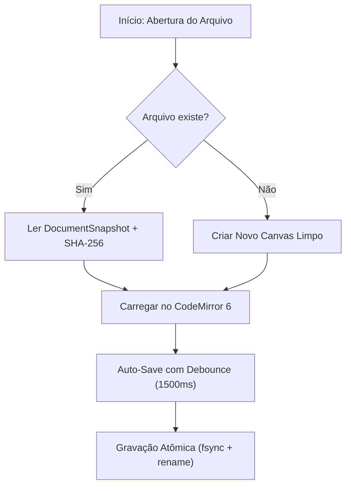

# Guia Técnico de Autoria e Recursos — MD Studio

O **MD Studio** é um editor Markdown local-first de engenharia, projetado para documentação técnica de alta fidelidade sem dependências em nuvem ou serviços externos.

Este guia reúne as especificações de sintaxe, extensões suportadas, comandos de formatação e boas práticas de autoria.

---

## 1. Sintaxe Markdown Básica e GitHub Flavored Markdown (GFM)

O pipeline do MD Studio utiliza o padrão **CommonMark** enriquecido com as extensões oficiais do **GitHub Flavored Markdown (GFM)**:

### 1.1. Títulos e Hierarquia
```markdown
# Título 1 (H1)
## Título 2 (H2)
### Título 3 (H3)
#### Título 4 (H4)
```
*Dica:* Todo cabeçalho gera automaticamente uma âncora navegável no **Painel de Sumário (Outline)** no lado direito da tela.

### 1.2. Estilização de Texto
* **Negrito:** `**texto em negrito**` ou `__texto em negrito__`
* *Itálico:* `*texto em itálico*` ou `_texto em itálico_`
* ~~Tachado:~~ `~~texto tachado~~`
* `Código inline:` `` `const valor = 42;` ``

### 1.3. Listas e Tarefas Interativas
```markdown
- Item não ordenado
  - Sub-item indentado
1. Item numerado
2. Segundo item

- [x] Tarefa técnica concluída
- [ ] Tarefa pendente
```

### 1.4. Tabelas GFM com Alinhamento
```markdown
| Parâmetro | Tipo | Descrição | Status |
| :--- | :---: | :--- | ---: |
| `workspace_id` | `String` | Identificador opaco do vault | Ativo |
| `relative_path` | `String` | Caminho do arquivo relativo à raiz | Ativo |
| `mtime_ms` | `u64` | Timestamp de modificação em milissegundos | Opcional |
```
*Recurso do Editor:* Quando o cursor é posicionado dentro de uma tabela no editor de fonte, a **Barra de Ferramentas de Tabela (`TableToolbar`)** é exibida automaticamente, permitindo inserir/excluir linhas e colunas com um clique.

### 1.5. Alertas e Callouts GFM
Blocos de alerta visual estilizados para orientar a leitura técnica:

```markdown
> [!NOTE]
> Informações úteis de contexto ou regras gerais do sistema.

> [!TIP]
> Dica de otimização, boas práticas ou produtividade.

> [!IMPORTANT]
> Requisito técnico essencial ou instrução obrigatória.

> [!WARNING]
> Aviso de incompatibilidade, comportamento inesperado ou mudança crítica.

> [!CAUTION]
> Ação de risco com potencial de perda de dados ou impacto de segurança.
```

---

## 2. Realce de Código TextMate (Shiki Dual-Themes)

O MD Studio integra o motor **Shiki** executado via WebAssembly com suporte nativo a temas duplos simultâneos (`github-light` e `github-dark`), sincronizados instantaneamente com o tema visual ativo:

````markdown
```rust
use std::path::PathBuf;

pub struct DocumentSnapshot {
    pub relative_path: PathBuf,
    pub content_hash: String,
    pub mtime_ms: u64,
}
```
````

### Linguagens com Suporte Completo
`rust`, `typescript`, `javascript`, `python`, `go`, `c`, `cpp`, `csharp`, `java`, `html`, `css`, `json`, `yaml`, `toml`, `sql`, `bash`, `shell`, `dockerfile`, `markdown`, entre dezenas de outras linguagens suportadas pela gramática TextMate.

---

## 3. Hub Híbrido de Formatação de Código

O MD Studio oferece um sistema exclusivo de formatação de blocos de código com dupla camada (Web + Rust CLI):

### 3.1. Como Formatar no Editor
* **Atalho Global:** Pressione **`Shift + Alt + F`** com o cursor posicionado dentro de qualquer bloco cercado de código.
* **Barra de Formatação:** Clique no botão de formatação de código na `FormattingToolbar`.
* **Botão no Preview:** No modo preview ou split, cada bloco de código possui o botão `Formatar` no canto superior direito.

### 3.2. Formatação na Camada Web (Instantânea)
Executada via Prettier Standalone local no Webview, sem necessidade de programas instalados no sistema operacional:
* JavaScript / JSX (`javascript`, `js`, `jsx`)
* TypeScript / TSX (`typescript`, `ts`, `tsx`)
* JSON / JSON5 (`json`)
* YAML (`yaml`, `yml`)
* HTML (`html`)
* CSS, SCSS e Less (`css`, `scss`, `less`)
* Markdown (`markdown`, `md`)

### 3.3. Formatação na Camada Nativa (Formatadores de Linha de Comando)
Caso a linguagem do bloco pertença ao conjunto abaixo, o MD Studio invoca com segurança a ferramenta CLI instalada no seu Linux com timeout de 2 segundos:

| Linguagem | Ferramenta CLI Invocada | Como Disponibilizar no Linux |
| :--- | :--- | :--- |
| **Python** (`python`, `py`) | `ruff format -` | `pip install ruff` ou `apt install python3-ruff` |
| **Rust** (`rust`, `rs`) | `rustfmt` | `rustup component add rustfmt` |
| **Go** (`go`) | `gofmt` | Incluso nativamente na instalação do Go |
| **C / C++** (`c`, `cpp`, `cxx`, `h`, `hpp`) | `clang-format` | `sudo apt install clang-format` |
| **C#** (`csharp`, `cs`) | `clang-format` | `sudo apt install clang-format` |
| **Java** (`java`) | `google-java-format -` ou `clang-format` | Instalável via gerenciador de pacotes |
| **PHP** (`php`) | `php-cs-fixer fix --quiet -` | Instalável via Composer |
| **Dart** (`dart`) | `dart format` | Incluso nativamente no SDK do Dart / Flutter |

*Segurança e Resiliência:* Se a ferramenta CLI não estiver instalada no seu `PATH` ou se o código contiver erros de sintaxe graves, o MD Studio mantém o código original intocado, sem travar o editor ou corromper o arquivo.

---

## 4. Fórmulas Matemáticas (KaTeX)

Fórmulas matemáticas são renderizadas com alta precisão tipográfica:

* **Matemática Inline:** Envolva expressões entre `$ ... $`:  
  `A relação fundamental de Einstein é $E = mc^2$, onde $c \approx 3 \times 10^8 \text{ m/s}$.`
* **Matemática em Bloco:** Envolva expressões em linhas separadas com `$$ ... $$`:

```markdown
$$
\int_{-\infty}^{+\infty} e^{-x^2} \, dx = \sqrt{\pi}
$$
```

Suporta notação completa de matrizes, frações (`\frac{a}{b}`), somatórios (`\sum_{i=1}^n`), limites (`\lim_{x \to 0}`) e símbolos gregos.

---

## 5. Diagramas Interativos (Mermaid.js)

O MD Studio possui um motor dedicado e isolado para **Mermaid.js**, com controles interativos de navegação e exportação:

### 5.1. Exemplo de Diagrama de Fluxo
````markdown

````

### 5.2. Recursos Exclusivos do Renderizador Mermaid
* **Pan & Zoom Interativo:** Arraste com o mouse para mover o diagrama e use a roda do mouse (*wheel*) ou os botões `+`, `-`, `1:1` para navegar em diagramas grandes.
* **Resiliência a Digitação:** Enquanto você digita sintaxe parcial, o MD Studio mantém o último diagrama válido com o indicador discreto `[Sintaxe incompleta]`, prevenindo piscadas de tela ou erros no DOM.
* **Exportação SVG Fiel:** O botão `SVG` consolida automaticamente todas as regras de CSS computadas do tema e as embute dentro do SVG. O arquivo gerado abre perfeitamente no Inkscape, Figma, Illustrator ou navegadores.
* **Exportação PNG em Alta Densidade:** O botão `PNG` renderiza o diagrama em canvas offscreen de alta resolução para download imediato.
* **Copiar SVG:** Copia o código SVG estilizado diretamente para a área de transferência.
* **Ver Código-Fonte:** Botão para alternar instantaneamente entre a renderização visual e o código Mermaid original.

---

## 6. Conexões Bidirecionais: Wiki Links e Backlinks

O MD Studio suporta interconexão fluida de documentos em formato de base de conhecimento (*second brain* / Zettelkasten leve):

### 6.1. Sintaxe de Wiki Links
* **Link Direto:** `[[NomeDoArquivo]]` ou `[[subpasta/Documento]]` (a extensão `.md` é opcional).
* **Link com Rótulo Personalizado:** `[[NomeDoArquivo|Texto Legível do Link]]`.
* **Autocompleção Rápida:** Ao digitar `[[` no editor, um menu suspenso é aberto listando todas as notas indexadas no workspace para seleção imediata com `Enter`.

### 6.2. Status de Resolução de Links
* **`Resolved` (Verde/Azul):** O documento alvo existe no workspace. Clicar nele abre o arquivo imediatamente.
* **`Unresolved` (Âmbar/Tracejado):** O documento ainda não existe. Clicar nele abre o diálogo **`Criar nota a partir do link`**, gerando o arquivo no disco e abrindo-o no editor com um clique.
* **`Ambiguous`:** Existem dois ou mais arquivos com o mesmo nome em subdiretórios diferentes.

### 6.3. Painel de Backlinks (Referências Reversas)
No painel direito, a aba **Backlinks** lista todas as outras notas do seu workspace que apontam para o arquivo atualmente aberto:
* Exibe o nome do documento referenciador e o número da linha da ocorrência.
* Mostra o snippet textual do contexto ao redor do link.
* **Navegação com 1 Clique:** Clicar no backlink abre o documento de origem e salta o cursor exatamente para a linha do link referenciador.

---

## 7. Atalhos de Produtividade do MD Studio

| Atalho | Categoria | Descrição |
| :---: | :---: | :--- |
| **`Ctrl + N`** | Arquivo | Novo documento (abre seletor de modelos de template). |
| **`Ctrl + S`** | Arquivo | Persistência atômica forçada do documento ativo. |
| **`Ctrl + Shift + S`** | Arquivo | Salvar como novo arquivo. |
| **`Ctrl + O`** | Arquivo | Abrir arquivo Markdown via diálogo nativo. |
| **`Ctrl + Shift + O`** | Workspace | Abrir pasta local como Workspace. |
| **`Ctrl + P`** | Navegação | Quick Switcher (busca rápida fuzzy de arquivos e notas). |
| **`Ctrl + G`** | Navegação | Ir para linha específica do documento (*Go to Line*). |
| **`Ctrl + 1`** | Visão | Alternar para modo **Markdown** (somente editor). |
| **`Ctrl + 2`** | Visão | Alternar para modo **Formatado** (somente preview). |
| **`Ctrl + 3`** | Visão | Alternar para modo **Dividida** (editor e preview lado a lado). |
| **`F11`** | Visão | Alternar modo **Zen** (tela cheia sem menus ou barras). |
| **`Ctrl + B`** | Painéis | Alternar visibilidade da barra lateral esquerda (Árvore de Arquivos). |
| **`Ctrl + J`** | Painéis | Alternar visibilidade do painel direito (Sumário / Links / Backlinks). |
| **`Shift + Alt + F`** | Edição | Formatar bloco de código ativo (Prettier ou ferramenta nativa CLI). |
| **`Ctrl + ,`** | Sistema | Abrir painel de preferências (tema visual, zoom da interface). |
| **`F1`** | Ajuda | Abrir catálogo visual de todos os atalhos de teclado. |

---

## 8. Dica de Execução em Distros Linux Específicas (Ex.: Slackware)

Se ao executar o MD Studio no Slackware ou em distribuições Linux com drivers gráficos legados (NVIDIA proprietário ou Mesa sem suporte a buffers DMA-BUF) a interface gráfica carregar como uma **janela em branco ou vazia**:

Execute com a diretiva de compatibilidade:
```bash
WEBKIT_DISABLE_DMABUF_RENDERER=1 md-studio
```
*(Ou no caso de AppImage: `WEBKIT_DISABLE_DMABUF_RENDERER=1 ./md-studio_*.AppImage`).*

Essa configuração desativa o renderizador DMA-BUF no WebKitGTK e restaura a renderização gráfica estável sem perda de funcionalidade.
